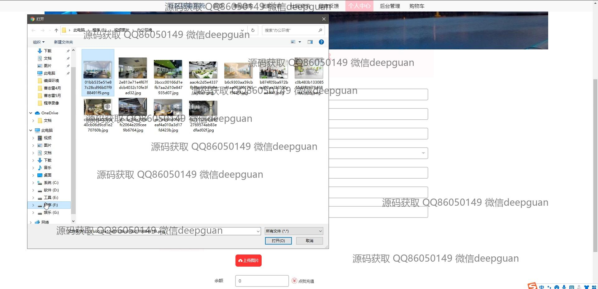
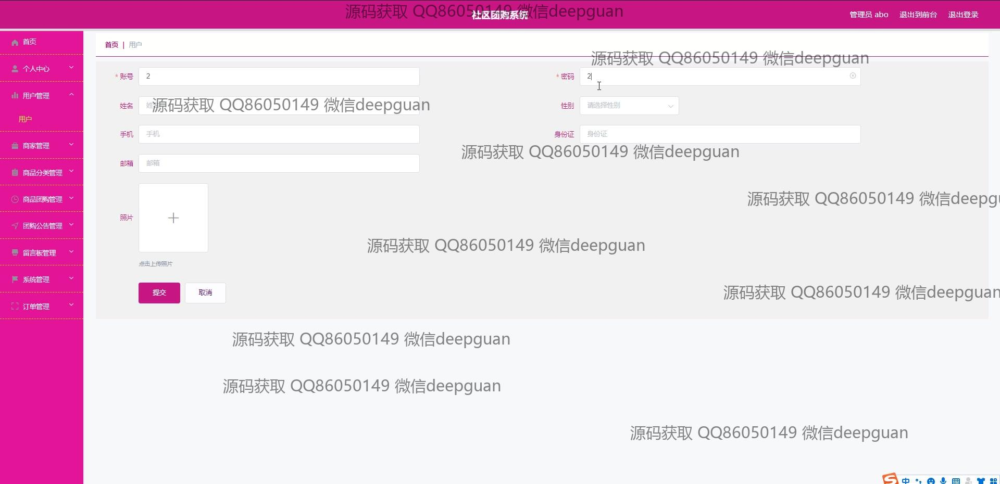
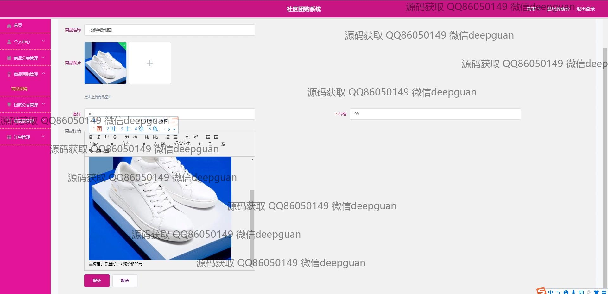
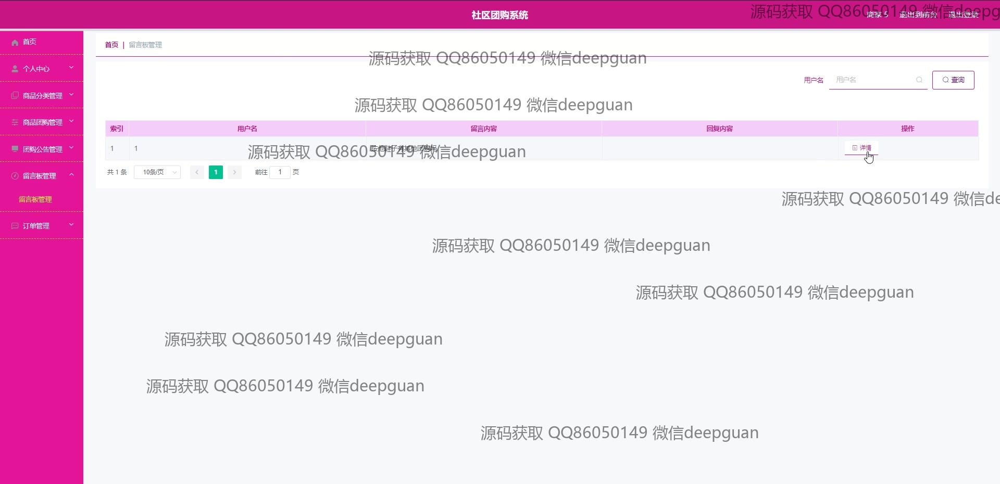

<h1 align="center">社区团购系统的设计与实现+vue</h1>

## 简介
社区团购系统：角色分为管理员、用户；支持商品管理、订单管理、留言管理、公告发布、商家注册、用户管理等功能，界面简洁，操作便捷，用户体验友好。    --计算机毕业设计源码；毕设源码；java毕业设计源码

## 联系方式

<h3 align="center">获取完整代码与数据库文件 + 微信：deepguan QQ: 86050149 QQ群: 783742310</h3>

<h3 align="center">可帮忙远程部署 包运行成功！提供远程部署、修改代码、设计文档指导、代码讲解等服务！</h3>

## 功能介绍（完整见运行截图）
管理员：登录、注册、退出功能，管理网站首页主导航栏、商品推荐、公告管理、用户管理、商家管理及商品管理。可审核和管理留言，查看和编辑商家信息，进行订单管理，公告发布及编辑操作。能够通过商品分类管理和商品团购管理模块维护商品信息，查询特定商品或订单详情，并支持分页查询与管理功能。

商家：注册及登录功能，管理个人中心，查看和编辑商家信息及商品信息，包括商品名称、分类、编码、价格、备注及图片上传。能够参与商品团购管理，查看订单明细，上传或更新商家Logo，管理商品分类并发布商品公告。支持商品信息的详细维护，通过商品团购模块实现参与团购活动，并进行商品详情的编辑与发布。

用户：注册及登录功能，访问网站首页，通过导航栏浏览商品团购、社区资讯及公告。可查看商品详情，添加商品至购物车并进行结算。通过个人中心查看和修改个人信息，管理地址和订单，进行图片上传。支持留言反馈，通过商品分类及搜索功能快速找到商品，参与商品评价与留言互动，查看公告信息。

游客：可通过网站首页浏览不同类别商品，查看商品推荐和公告信息。支持访问商品详情页获取商品详细信息，浏览社区资讯和店铺展示。通过公告和自然风光展示功能了解网站动态，注册成为用户参与团购活动。首页提供的轮播图和公告信息提升用户访问体验，可注册成为用户以使用更多功能。

## 运行截图

本代码来源于网络,仅供学习参考使用!

